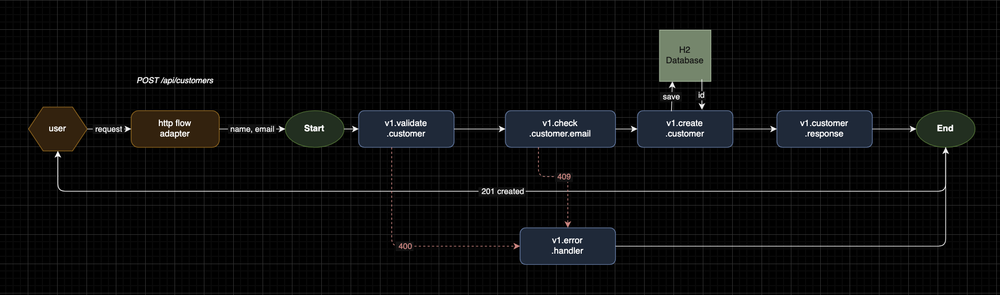
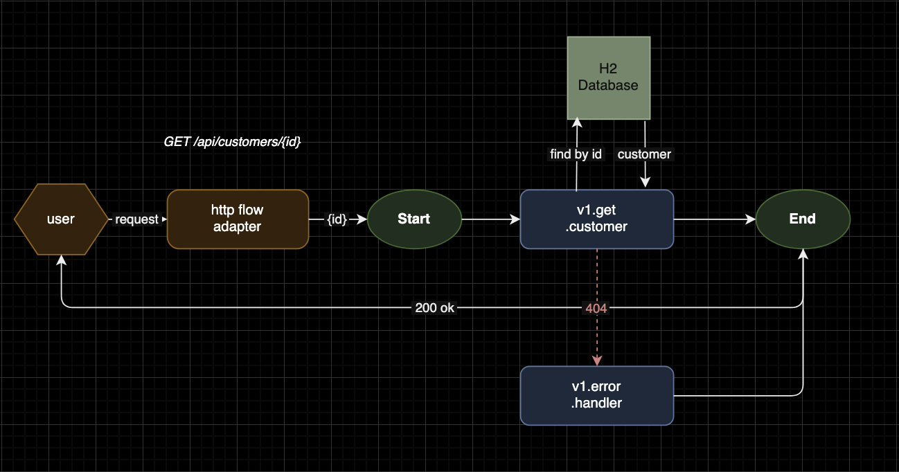

# Customer Service

A RESTful microservice for customer management built with the Mercury Composable framework and Spring Data JPA.

---

## Table of Contents

1. [Overview](#overview)
2. [Technology Stack](#technology-stack)
3. [Getting Started](#getting-started)
4. [Running Tests](#running-tests)
5. [Architecture](#architecture)
6. [API Endpoints](#api-endpoints)
7. [Flow Diagrams](#flow-diagrams)
8. [Project Structure](#project-structure)

---

## Overview

This service provides a simple customer management API with two operations: creating a customer and retrieving a customer by ID. It is built on the **Mercury Composable** architecture, where each business operation is broken down into small, independent functions called tasks. Tasks do not call each other directly — they communicate exclusively through an event bus and are orchestrated by a declarative YAML flow engine.

---

## Technology Stack

| Component | Technology |
|-----------|------------|
| Language | Java 21 |
| Framework | Mercury Composable 4.4.4 |
| HTTP Server | Netty (via Mercury REST automation) |
| Spring Boot | 3.5.12 (for dependency injection and JPA) |
| Persistence | Spring Data JPA + Hibernate |
| Database | H2 (in-memory) |
| Build Tool | Gradle 9 |
| Testing | JUnit 5 — end-to-end integration tests |

---

## Getting Started

**Prerequisites:** Java 21, Gradle (wrapper included).

**Build Mercury locally** (required — Mercury 4.4.4 is not published to Maven Central):

```bash
cd /path/to/mercury-composable
mvn install -DskipTests
```

**Run the application:**

```bash
./gradlew run
```

The REST API is available at `http://localhost:8100`.  
The H2 web console is available at `http://localhost:8085/h2-console`.

H2 console connection settings:
```
JDBC URL:  jdbc:h2:mem:customerdb
Username:  sa
Password:  (leave blank)
```

**Example requests:**

```bash
# Create a customer
curl -X POST http://localhost:8100/api/customers \
  -H "Content-Type: application/json" \
  -d '{"name": "Alice", "email": "alice@example.com"}'

# Get a customer
curl http://localhost:8100/api/customers/1
```

---

## Running Tests

```bash
./gradlew test
```

Tests are written as end-to-end integration tests following the Mercury Composable testing pattern. The test suite starts the full application (including Netty server, Spring context, and H2 database) via `AutoStart.main()` and sends real HTTP requests through Mercury's built-in `async.http.request` client.

This approach validates the complete request path: HTTP routing, YAML flow execution, task logic, database interaction, and error handling — all in a single test run.

The test application starts on port 8083 and uses a separate in-memory H2 database (`testdb`) to avoid conflicts with a running instance of the application.

---

## Architecture

This service follows the **Composable Architecture** pattern. Instead of a layered Service → Repository model, each business operation is defined as a YAML flow — a pipeline of independent task functions connected through the Mercury event bus.

```
HTTP Request
    |
    v
rest.yaml          -- maps URL + method to a named flow
    |
    v
flows/*.yaml       -- declares the task pipeline and data mapping
    |
    v
Task Functions     -- stateless Java functions registered via @PreLoad
    |
    v
CustomerRepository -- Spring Data JPA → H2 Database
```

Each task is registered in the event bus under a unique route name (e.g. `v1.validate.customer`) and runs independently. The flow engine handles sequencing, data passing between tasks, and error routing. Tasks with JPA calls run on kernel threads via `@KernelThreadRunner` to ensure compatibility with Hibernate's thread-local transaction management.

**Two server ports are used:**

| Port | Server | Purpose |
|------|--------|---------|
| 8100 | Netty (Mercury) | REST API — handles all requests defined in `rest.yaml` |
| 8085 | Tomcat (Spring Boot) | H2 web console at `/h2-console` |

---

## API Endpoints

### Create a Customer

```
POST /api/customers
Content-Type: application/json
```

Request body:
```json
{
  "name": "Alice",
  "email": "alice@example.com"
}
```

Responses:

| Status | Description |
|--------|-------------|
| 201 | Customer created successfully |
| 400 | Validation failed (blank name, invalid email format, field too long) |
| 409 | A customer with the given email already exists |

Success response body:
```json
{
  "id": 1,
  "name": "Alice",
  "email": "alice@example.com"
}
```

---

### Get a Customer

```
GET /api/customers/{id}
```

Responses:

| Status | Description |
|--------|-------------|
| 200 | Customer found |
| 404 | Customer with the given ID does not exist |

Success response body:
```json
{
  "id": 1,
  "name": "Alice",
  "email": "alice@example.com"
}
```

Error response body (400 / 404 / 409):
```json
{
  "type": "error",
  "status": 404,
  "message": "Customer with id 1 not found"
}
```

---

## Flow Diagrams

### Figure 1 — Create a Customer (`POST /api/customers`)



The request enters through the `http flow adapter` which extracts the name and email from the HTTP request body and passes them into the flow pipeline.

The pipeline consists of four sequential tasks:

1. **v1.validate.customer** — validates that name and email are not blank, do not exceed maximum length, and that the email matches a valid format. Throws `IllegalArgumentException` (HTTP 400) on failure.

2. **v1.check.customer.email** — queries the database to verify that no customer with the same email already exists. Throws `CustomerAlreadyExistException` (HTTP 409) on a duplicate.

3. **v1.create.customer** — persists the new customer to the H2 database via Spring Data JPA and retrieves the auto-generated ID.

4. **v1.customer.response** — assembles the final response map with `id`, `name`, and `email`, and sets the HTTP status to 201.

Any exception thrown by any task is automatically intercepted by the flow engine and routed to **v1.error.handler**, which formats a structured error response and sets the appropriate HTTP status code.

---

### Figure 2 — Get a Customer (`GET /api/customers/{id}`)



The request enters through the `http flow adapter` which extracts the `id` path parameter and passes it into the flow.

The pipeline consists of one task:

1. **v1.get.customer** — parses the ID, queries the H2 database via Spring Data JPA. If the customer is found, it is returned directly as the response body with HTTP 200. If not found, it throws `AppException(404)` which is routed to **v1.error.handler**.

---

## Project Structure

```
src/
├── main/
│   ├── java/com/deviceshop/customer/
│   │   ├── MainApp.java                         -- application entry point
│   │   ├── config/
│   │   │   └── JpaConfig.java                   -- enables JPA repository scanning
│   │   ├── exceptions/
│   │   │   └── CustomerAlreadyExistException.java
│   │   ├── models/
│   │   │   └── Customer.java                    -- JPA entity
│   │   ├── dto/
│   │   │   └── CustomerRequest.java             -- POJO for HTTP request deserialization
│   │   ├── storage/
│   │   │   └── CustomerRepository.java          -- Spring Data JPA repository
│   │   └── tasks/
│   │       ├── ValidateCustomer.java
│   │       ├── CheckCustomerEmail.java
│   │       ├── CreateCustomer.java
│   │       ├── GetCustomer.java
│   │       ├── BuildCustomerResponse.java
│   │       └── ErrorHandler.java
│   └── resources/
│       ├── application.properties
│       ├── rest.yaml                            -- HTTP route definitions
│       ├── flows.yaml                           -- flow registry
│       └── flows/
│           ├── create-customer.yaml
│           └── get-customer.yaml
└── test/
    ├── java/com/deviceshop/customer/
    │   ├── support/
    │   │   └── TestBase.java                    -- starts the full application once
    │   └── flows/
    │       └── CustomerFlowTest.java            -- end-to-end integration tests
    └── resources/
        └── application.properties               -- test configuration (port 8083, H2 testdb)
```

